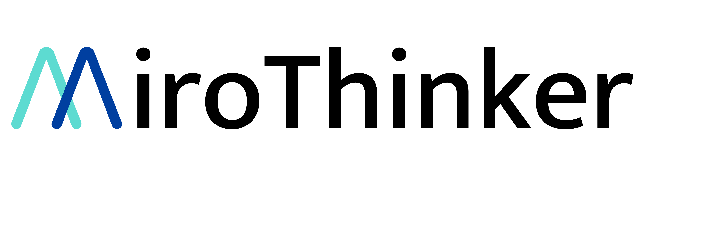

<div align="center">
  
</div>

# 🍴 MiroThinker (Gemini Edition Fork)

> **⚠️ Note:** This is a fork of the original [MiroThinker](https://github.com/MiroMindAI/MiroThinker) project. It has been heavily modified to use **Google Gemini** as the primary LLM provider and leverages **Google Search Grounding** via GCP project credits.

This fork removes dependencies on separate API subscriptions (OpenAI, Anthropic, Serper) for the core agent loop, allowing you to run a powerful research agent entirely within the Google Cloud ecosystem.

## ✨ Key Features (Gemini Edition)

- **Gemini Native**: Replaces OpenAI/Anthropic logic with `google-genai` SDK support.
- **Search Grounding**: Uses Gemini's built-in Google Search Grounding instead of external search tools (Serper).
- **Multimodal**: Uses Gemini 1.5 Pro/Flash for image, audio, and video understanding.
- **GCP Authentication**: Authenticates purely via Google Cloud credentials (JSON key or API Key).

## 🚀 Quick Start

### Prerequisites

- 🐍 **Python 3.10+**
- 📦 **uv package manager** ([Installation guide](https://github.com/astral-sh/uv))
- ☁️ **Google Cloud Project** with Vertex AI API enabled (or Google AI Studio key)

### Installation

```bash
# Clone the repository
git clone <YOUR_REPO_URL>
cd MiroThinker

# Setup environment
cd apps/miroflow-agent
uv sync

# Configure environment
cp .env.example .env
```

### ⚡️ Configuration

This fork is designed to work with **Google Gemini**.

1.  **Authentication**:
    *   **Option A (Recommended):** GCP Service Account
        *   Place your GCP Service Account JSON key on your machine.
        *   Set the path in `apps/miroflow-agent/.env`:
            ```bash
            GOOGLE_APPLICATION_CREDENTIALS="/path/to/your/credentials.json"
            ```
    *   **Option B:** Google AI Studio Key
        *   Set `GOOGLE_API_KEY` in `.env`.

2.  **Tools**:
    *   You still need an **E2B API Key** for the code execution sandbox.
    *   You do **NOT** need a Serper API key (Google Search is handled by Gemini).
    *   You do **NOT** need an OpenAI key for the main agent loop.

3.  **Run the Agent**:

    Run the agent specifying the Gemini provider and model.

    ```bash
    cd apps/miroflow-agent

    # Run with Gemini 1.5 Pro
    uv run python main.py llm.provider=gemini llm.model_name=gemini-1.5-pro agent=mirothinker_v1.5_keep5_max200

    # Run with Gemini 2.0 Flash (if available/preview)
    uv run python main.py llm.provider=gemini llm.model_name=gemini-2.0-flash-exp agent=mirothinker_v1.5_keep5_max200
    ```

    **To customize your question**, edit `apps/miroflow-agent/main.py` line 32:
    ```python
    task_description = "Your custom question here"
    ```

### Tool Configuration

The agent uses **MiroFlow Tools**. In this fork, the configuration is simplified:

| Server | Function in this Fork | Required Env Vars |
|:-------|:----------------------|:------------------|
| **`tool-python`** | Code execution sandbox (E2B) | `E2B_API_KEY` |
| **`search_and_scrape_webpage`** | **Intercepted:** Calls Gemini Grounding automatically | `GOOGLE_APPLICATION_CREDENTIALS` |
| **`jina_scrape_llm_summary`** | Web scraping & extraction | `JINA_API_KEY` |

## ❓ FAQ

#### **Q: Do I need a Serper API key?**
**A:** No. When the agent tries to use the Google Search tool, the `GeminiClient` intercepts this request and uses Google's native Search Grounding feature, consuming your Vertex AI/GCP quotas instead.

#### **Q: Can I still use OpenAI models?**
**A:** Yes, the original code is preserved. If you set `llm.provider=openai`, it will revert to the standard behavior (requiring OpenAI and Serper keys). However, the primary purpose of this fork is Gemini integration.

## 📄 License

This project is licensed under the MIT License - see the [LICENSE](LICENSE) file for details.

## 🙏 Acknowledgments

This is a fork of [MiroThinker](https://github.com/MiroMindAI/MiroThinker). All credit for the original architecture and agent framework goes to the MiroMind AI team.
