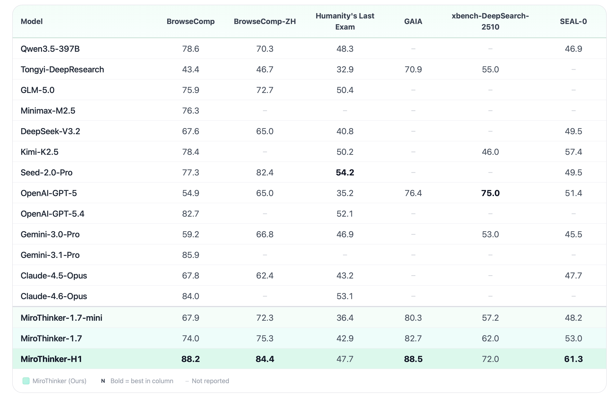

<div align="center">
  
</div>

<br>

<div align="center">

[](https://huggingface.co/collections/miromind-ai/mirothinker-17)
[](https://miromind.ai/#blog)
[](https://huggingface.co/datasets/miromind-ai/MiroVerse-v0.1)

[](https://github.com/MiroMindAI)
[](https://miromind.ai/)
[](https://discord.com/invite/GPqEnkzQZd)

</div>

<p align="center">
  <strong>中文</strong> | <a href="README.md">English</a>
</p>

<div align="center">

### 🚀 [立即体验 MiroThinker!](https://dr.miromind.ai/)

</div>

**MiroThinker**: 专为研究和预测优化的深度研究智能体（Deep Research Agent）。它在极具挑战性的 BrowseComp 基准测试中达到了 88.2 分。参见[快速开始](#-快速开始)。


## 📋 目录

- 📰 [新闻与更新](#-新闻与更新)
- 📝 [项目介绍](#-项目介绍)
- ✨ [核心特性](#-核心特性)
- 📈 [基准测试表现](#-基准测试表现)
- 🚀 [快速开始](#-快速开始)
- 📊 [基准测试评估](#-基准测试评估)
- 🔬 [轨迹收集](#-轨迹收集)
- ❓ [常见问题与故障排除](#-常见问题与故障排除)
- 📄 [开源协议](#-开源协议)
- 🙏 [致谢](#-致谢)

## 📰 新闻与更新
- **[2026-03-11]** 🎉🎉🎉 发布 [MiroThinker-1.7](https://huggingface.co/collections/miromind-ai/mirothinker-17)，包括 [MiroThinker-1.7-mini](https://huggingface.co/miromind-ai/MiroThinker-1.7-mini) 和 [MiroThinker-1.7](https://huggingface.co/miromind-ai/MiroThinker-1.7)。MiroThinker-1.7-mini 在 BrowseComp-ZH 上获得 72.3 分，在仅使用 30B 参数的情况下创下了开源模型的新 SOTA（业内领先水平）。我们的闭源智能体 MiroThinker-H1 在 BrowseComp 和 BrowseComp-ZH 上均在开源及商业模型中保持领先。
- **[2026-01-23]** 🎉 我们为 [MiroThinker 在线版](http://dr.miromind.ai) 带来了两项重要更新：(a) 核心研究报告生成：Deep Research 在线报告现在支持生成、预览和分享。(b) 扩展文档上传类型：现支持上传多种文件格式，如 `.pdf`, `.doc`, `.ppt`, `.xls`, `.jpg`。欢迎试用！MiroThinker 将持续维护并迭代升级，目标是成为您用过的最好的研究智能体！
- **[2026-01-05]** 🎉🎉 我们发布了 [MiroThinker-v1.5](https://huggingface.co/collections/miromind-ai/mirothinker-v15)，这是一系列专为金融预测优化的开源深度研究智能体。[MiroThinker-v1.5-30B](https://huggingface.co/miromind-ai/MiroThinker-v1.5-30B) 在 BrowseComp-ZH 上以极低的成本超越了 Kimi-K2-Thinking，参数量仅为其 1/30。[MiroThinker-v1.5-235B](https://huggingface.co/miromind-ai/MiroThinker-v1.5-235B) 在 HLE-Text 获得 39.2%，BrowseComp 获得 69.8%，BrowseComp-ZH 获得 71.5%，GAIA-Val-165 获得 80.8%，在搜索智能体中创下新纪录。


<details>
  <summary>📜 点击展开历史更新</summary>

- **[2025-11-13]** 🎉 [MiroThinker-v1.0](https://huggingface.co/collections/miromind-ai/mirothinker-v10) 正式发布！引入了**交互式缩放（Interactive Scaling）**作为性能提升的第三维度，MiroThinker v1.0 支持 256K 上下文窗口，每个任务支持高达 600 次工具调用。提供 8B、30B 和 72B 参数规模，在 HLE-Text、BrowseComp、BrowseComp-ZH 和 GAIA-Text-103 上分别获得 37.7%、47.1%、55.6% 和 81.9%。详见[技术报告](https://arxiv.org/abs/2511.11793)。
- **[2025-09-11]** MiroThinker-72B-Preview 在本周的 FutureX 基准测试中排名第四。参见 [FutureX](https://futurex-ai.github.io/)。
- **[2025-09-08]** [MiroThinker-v0.2](https://huggingface.co/collections/miromind-ai/mirothinker-v02) 发布，在多个基准测试中实现开源 SOTA，包括 HLE (17.8%), HLE-Text-Only (19.1%), BrowseComp-EN (17.2%), BrowseComp-ZH (29.4%), XBench-DeepSearch (56.0%) 和 Frames (74.8%)。
- **[2025-09-07]** 我们支持了更多基准测试，包括 [BrowseComp-ZH](https://arxiv.org/abs/2504.19314), [XBench-DeepSearch](https://xbench.org/agi/aisearch) 和 [FutureX](https://futurex-ai.github.io/)。
- **[2025-08-22]** 引入了 MiroThinker 的精简部署选项，优化了资源占用并加快了启动速度。体验交互式演示：[🚀 尝试 Gradio Demo](apps/gradio-demo)
- **[2025-08-08]** [MiroThinker-v0.1](https://huggingface.co/collections/miromind-ai/mirothinker-v01-689301b6d0563321862d44a1) 发布。

</details>

## 📝 项目介绍

### MiroThinker-1.7
我们全新的 MiroThinker 系列代表了构建可靠长链任务智能体的重大飞跃。通过增强的后训练流水线，MiroThinker-1.7 系列在开源模型的深度研究任务中实现了 SOTA 性能。


**核心特性**

- 🚀 MiroThinker-1.7 支持 256K 上下文窗口、长程推理和深度多步分析。
- 🔧 每个任务可处理多达 300 次工具交互，现在具备更精确的分步推理和决策能力。
- 📦 发布了 30B 和 235B 两种参数规模，并附带一套完整的工具和工作流，灵活支持不同的研究场景和计算预算。
- 我们的闭源智能体 MiroThinker-H1 为长链可验证推理提供了有力证据——即分步可验证且全局可验证的推理过程，显著提升了复杂智能体工作流的性能。

<div align="center">

|      模型名称       |         参数量            | 最大上下文 | 最大工具调用 |                              HF 链接                               |
|:---------------------:|:-----------------------------:|:-----------:|:--------------:|:------------------------------------------------------------------:|
| MiroThinker-1.7-mini  | 30B   |    256K     |      300       | [🤗 链接](https://huggingface.co/miromind-ai/MiroThinker-1.7-mini) |
| MiroThinker-1.7 | 235B |    256K     |      300       | [🤗 链接](https://huggingface.co/miromind-ai/MiroThinker-1.7) |

</div>

MiroThinker-1.7 在广泛的基准测试中展现出强大的通用研究性能，在 BrowseComp、BrowseComp-ZH、GAIA-Val-165 和 HLE-Text 上分别获得了 74.0%、75.3%、82.7% 和 42.9% 的成绩。MiroThinker-1.7 在 BrowseComp-ZH 上实现了 SOTA。


### MiroThinker-v1.5

<details>
  <summary>📦 点击展开 MiroThinker-v1.5 详情</summary>

MiroThinker v1.5 是世界领先的开源搜索智能体，它通过**交互式缩放（Interactive Scaling）**推进了工具增强推理——训练智能体处理更深层、更频繁的智能体-环境交互，作为模型大小和上下文长度之外的第三个性能提升维度。


**核心特性**

- 🚀 MiroThinker v1.5 支持 256K 上下文窗口、长程推理和深度多步分析。
- 🔧 每个任务可处理多达 400 次工具调用——相比之前的开源研究智能体有显著提升。
- 📦 发布了 30B 和 235B 两种参数规模，并附带一套完整的工具和工作流。

<div align="center">

|      智能体名称       |         基础智能体            | 最大上下文 | 最大工具调用 |                              HF 链接                               |
|:---------------------:|:-----------------------------:|:-----------:|:--------------:|:------------------------------------------------------------------:|
| MiroThinker-v1.5-30B  | Qwen3-30B-A3B-Thinking-2507   |    256K     |      400       | [🤗 链接](https://huggingface.co/miromind-ai/MiroThinker-v1.5-30B) |
| MiroThinker-v1.5-235B | Qwen3-235B-A22B-Thinking-2507 |    256K     |      400       | [🤗 链接](https://huggingface.co/miromind-ai/MiroThinker-v1.5-235B) |

</div>

MiroThinker v1.5 在 HLE-Text, BrowseComp, BrowseComp-ZH, 和 GAIA-Val-165 上分别获得 39.2%, 69.8%, 71.5%, 和 80.8% 的优异成绩。这些结果超越了以往的开源智能体，树立了全球领先的 BrowseComp 性能标杆。


</details>

### MiroThinker-v1.0

<details>
  <summary>📦 点击展开 MiroThinker-v1.0 详情</summary>

不同于仅缩放模型大小或上下文长度的以往智能体，MiroThinker v1.0 在智能体层面引入了**交互式缩放**，系统地训练智能体处理更深层、更频繁的智能体与环境的交互。交互式缩放利用环境反馈和外部信息获取来纠正错误并优化路径。


### ✨ 核心特性

- 🚀 **256K 上下文窗口**: 支持长程推理和深度多步分析。
- 🔧 **600 次工具调用**: 每个任务处理多达 600 次工具调用——较以往开源智能体有实质性提升。
- 📦 **多种规模**: 提供 8B, 30B, 和 72B 参数规模，灵活支持不同的研究场景。

<div align="center">

|      智能体名称      |         基础智能体          | 最大上下文 | 最大工具调用 |                              HF 链接                               |
|:--------------------:|:---------------------------:|:-----------:|:--------------:|:------------------------------------------------------------------:|
| MiroThinker-v1.0-8B  |        Qwen3-8B             |    256K     |      600       | [🤗 链接](https://huggingface.co/miromind-ai/MiroThinker-v1.0-8B)  |
| MiroThinker-v1.0-30B | Qwen3-30B-A3B-Thinking-2507 |    256K    |      600       | [🤗 链接](https://huggingface.co/miromind-ai/MiroThinker-v1.0-30B) |
| MiroThinker-v1.0-72B |    Qwen2.5-72B-Instruct     |    256K    |      600       | [🤗 链接](https://huggingface.co/miromind-ai/MiroThinker-v1.0-72B) |

</div>

MiroThinker v1.0 在 HLE-Text、BrowseComp、BrowseComp-ZH 和 GAIA-Text-103 上分别达到了 **37.7%**, **47.1%**, **55.6%**, 和 **81.9%**。这些结果超越了以往的开源智能体，并缩小了与商业对手如 **GPT-5-high** 的差距。

<div align="center">
  
</div>

</details>

## ✨ 核心特性

### 🤖 **MiroThinker 优化框架**

- 🔓 **完全开源的智能体框架**: 框架和智能体完全透明开源。
- 🔗 **工具集成**: 与外部工具和 API 无缝集成。
- 📝 **轨迹收集**: 完整的日志记录和智能体交互分析，显示预计完成时间。支持 SFT 和 DPO。
- 📊 **基准测试评估**: 在多个基准测试集上进行广泛测试。

### 📊 **全面的基准测试套件**

<details open>
  <summary>📋 点击展开基准测试列表</summary>

- **GAIA Validation**: 通用 AI 助手基准测试。 ([论文](https://arxiv.org/abs/2311.12983))
- **GAIA-Text-103**: GAIA 验证集的纯文本任务子集。 ([论文](https://arxiv.org/abs/2505.22648))
- **HLE**: 人类最后的考试 (Humanity's Last Exam)。 ([论文](https://arxiv.org/abs/2501.14249))
- **HLE-Text-2158**: HLE 的纯文本任务子集。
- **HLE-Text-500**: 由 WebThinker 创建的 HLE 纯文本子集。
- **BrowseComp-EN**: 网络浏览与理解任务。 ([论文](https://arxiv.org/abs/2504.12516))
- **BrowseComp-ZH**: BrowseComp 的中文版本。 ([论文](https://arxiv.org/abs/2504.19314))
- **WebWalkerQA**: 网页导航与问答。 ([论文](https://arxiv.org/abs/2501.07572))
- **Frames**: 事实性、检索与推理测量集。 ([论文](https://arxiv.org/abs/2409.12941))
- **XBench-DeepSearch**: 深度研究智能体基准测试。 ([网站](https://xbench.org/agi/aisearch))
- **FutureX**: 用于预测未知未来的动态基准测试。 ([网站](https://futurex-ai.github.io/))
- **SEAL-0**: 评估 LLM 处理冲突证据网页问题的基准测试。 ([论文](https://arxiv.org/abs/2506.01062))
- **AIME2025**: 2025 年美国数学邀请赛。 ([网站](https://artificialanalysis.ai/evaluations/aime-2025))
- **DeepSearchQA**: Google 的深度搜索问答基准测试。 ([论文](https://arxiv.org/abs/2505.20827))

</details>

## 📈 基准测试表现

### MiroThinker-1.7

> 为防止潜在的信息泄漏（例如从 HuggingFace 检索基准测试答案），我们在评估期间屏蔽了某些网站。

<div>
  
</div>

## 🚀 快速开始

### 前提条件

- 🐍 **Python 3.10+**
- 📦 **uv 包管理器** ([安装指南](https://github.com/astral-sh/uv))
- 🔑 **必要的 API 密钥** (见下文配置部分)

### 安装

```bash
# 克隆仓库
git clone https://github.com/MiroMindAI/MiroThinker
cd MiroThinker

# 设置环境
cd apps/miroflow-agent
uv sync

# 配置 API 密钥
cp .env.example .env
# 使用您的 API 密钥编辑 .env 文件 (SERPER_API_KEY, JINA_API_KEY, E2B_API_KEY, 等)
```

> **📝 环境变量**: 参见[工具配置](#工具配置)部分了解所需的 API 密钥。

### 工具配置

#### MiroThinker-1.7 的最小化配置

| 服务 | 描述 | 提供的工具 | 必填环境变量 |
|:-------|:------------|:---------------|:-------------------------------|
| **`tool-python`** | 执行环境和文件管理 (E2B 沙箱) | `create_sandbox`, `run_command`, `run_python_code`, `upload_file_from_local_to_sandbox`, `download_file_from_sandbox_to_local`, `download_file_from_internet_to_sandbox` | `E2B_API_KEY` |
| **`search_and_scrape_webpage`** | 通过 Serper API 进行 Google 搜索 | `google_search` | `SERPER_API_KEY`, `SERPER_BASE_URL` |
| **`jina_scrape_llm_summary`** | 网页抓取与基于 LLM 的信息提取 | `scrape_and_extract_info` | `JINA_API_KEY`, `JINA_BASE_URL`, `SUMMARY_LLM_BASE_URL`, `SUMMARY_LLM_MODEL_NAME`, `SUMMARY_LLM_API_KEY` |

**最小化 `.env` 配置示例:**

```bash
# MiroThinker v1.5 和 v1.0 所需 (最小化设置)
SERPER_API_KEY=your_serper_key
SERPER_BASE_URL="https://google.serper.dev"
JINA_API_KEY=your_jina_key
JINA_BASE_URL="https://r.jina.ai"
E2B_API_KEY=your_e2b_key

# jina_scrape_llm_summary 所需
# 注意：总结 LLM 可以是小模型（如 Qwen3-14B 或 GPT-5-Nano）
SUMMARY_LLM_BASE_URL="https://your_summary_llm_base_url/v1/chat/completions"
SUMMARY_LLM_MODEL_NAME=your_llm_model_name  # 例如 "Qwen/Qwen3-14B" 或 "gpt-5-nano"
SUMMARY_LLM_API_KEY=your_llm_api_key  # 可选，取决于 LLM 提供商

# 基准测试评估所需 (LLM-as-a-Judge)
OPENAI_API_KEY=your_openai_key  # 运行基准评估脚本时需要
OPENAI_BASE_URL="https://api.openai.com/v1"  # 可选，默认为 OpenAI API
```

> **💡 为什么这是最小化配置**: 这 3 个 MCP 服务器涵盖了研究任务的核心能力：网页搜索、内容提取和代码执行。所有其他服务器都是可选的增强项。
>
> **🤖 总结 LLM**: `SUMMARY_LLM` 可以使用像 Qwen3-14B 或 GPT-5-Nano 这样的小模型。
>
> **📊 用于基准测试评估**: 如果您计划运行基准测试，还需要 `OPENAI_API_KEY`。
>
> **🖼️ 用于 GAIA 多模态任务**: GAIA-Val-165 包含图像/音频/视频文件任务。由于 MiroThinker 是纯文本模型，因此使用 GPT-4o 将这些文件预处理为文本描述。
>
> **📖 更多详情**: 参见 [MiroFlow 工具 README](libs/miroflow-tools/README.md)。

<details>
  <summary>🔧 点击展开更多可用工具</summary>

以下可选工具在 MiroThinker v1.0-1.7 评估中未使用，但可供选择：

| 服务器名称          | 类型         | 描述                                 |
|:---------------------|:-------------|:--------------------------------------------|
| `tool-vqa`           | 商业         | 使用 Claude 进行视觉处理                     |
| `tool-vqa-os`        | 开源         | 视觉处理 (开源替代方案)                      |
| `tool-transcribe`    | 商业         | 使用 OpenAI 进行音频转录                     |
| `tool-transcribe-os` | 开源         | 使用 Whisper 进行音频转录                    |
| `tool-reasoning`     | 商业         | 使用 Claude 的推理引擎                       |
| `tool-reasoning-os`  | 开源         | 推理引擎 (开源替代方案)                      |
| `tool-reading`       | 开源         | 使用 MarkItDown 进行文档阅读                 |
| `tool-google-search` | 商业         | 使用 Google 搜索 + 抓取                      |
| `tool-sogou-search`  | 商业         | 使用搜狗搜索 (中文)                          |

</details>

#### 预配置的智能体设置

`apps/miroflow-agent/conf/agent/` 目录包含多种预配置的设置。

> **💡 推荐**: 对于 MiroThinker-1.7，推荐大多数任务使用 `mirothinker_1.7_keep5_max200`（带上下文管理），或者 `mirothinker_1.7_keep5_max300`（仅用于 BrowseComp 和 BrowseComp-ZH）。

| 配置名称                          | 描述 | 最大轮数 | 上下文保留策略 | 推荐用于 |
|:---------------------------------------|:------------|:----------|:------------------|:----------------|
| **`mirothinker_1.7_keep5_max200`** ⭐  | 单智能体，带上下文管理 | 200 | 保留最近 5 条 | **1.7 (推荐大多数任务)** |
| **`mirothinker_1.7_keep5_max300`** ⭐  | 单智能体，带上下文管理 | 300 | 保留最近 5 条 | **1.7 (用于 BrowseComp)** |


### 部署 MiroThinker 智能体

#### 选项 1 (推荐): 使用 SGLang 或 vLLM 部署

使用 SGLang 在 61002 端口部署 MiroThinker 模型：

```bash
NUM_GPUS=4
PORT=61002

# 从 HF 下载智能体
AGENT_PATH=miromind-ai/MiroThinker-1.7-mini


python3 -m sglang.launch_server \
    --model-path $AGENT_PATH \
    --tp $NUM_GPUS \
    --dp 1 \
    --host 0.0.0.0 \
    --port $PORT \
    --trust-remote-code
```

> **📍 服务器 URL**: 这将在 `http://0.0.0.0:$PORT` 启动服务器。将其作为您的 base URL (例如 `http://0.0.0.0:61002/v1`)。

#### 选项 2: 量化轻量级选项

我们也提供了使用 CPU 优化和 GPU 加速量化技术的详细部署指南，支持 llama.cpp, Ollama, SGLang 等框架。详见[部署文档](apps/gradio-demo/)。

### 运行您的第一个任务

环境设置好并启动服务器后，运行 `main.py` 测试：

```bash
cd apps/miroflow-agent

# 使用 MiroThinker 智能体 (需要您自己的服务器)
uv run python main.py llm=qwen-3 agent=mirothinker_1.7_keep5_max200 llm.base_url=http://localhost:61002/v1

# 或使用 Claude (需要在 .env 中配置 ANTHROPIC_API_KEY)
uv run python main.py llm=claude-3-7 agent=single_agent_keep5

# 或使用 GPT-5 (需要在 .env 中配置 OPENAI_API_KEY)
uv run python main.py llm=gpt-5 agent=single_agent_keep5
```

智能体将搜索网页，必要时执行代码，并给出带来源的答案。

## 📊 基准测试评估

> 供想要复现基准测试结果的研究人员使用。

### 下载基准测试数据

```bash
cd MiroThinker  # 回到项目根目录
wget https://huggingface.co/datasets/miromind-ai/MiroFlow-Benchmarks/resolve/main/data_20251115_password_protected.zip
unzip data_20251115_password_protected.zip
# 密码: pf4*
rm data_20251115_password_protected.zip
```

### 运行基准评估

> **注意：** 对于 MiroThinker-1.7，请使用 `mirothinker_1.7_keep5_max200` 或 `mirothinker_1.7_keep5_max300`。

**示例用法:**

```bash
# 首先进入 miroflow-agent 目录
cd apps/miroflow-agent

# 使用 v1.7 的基础用法
NUM_RUNS=8 LLM_MODEL="MiroThinker-1.7-mini" BASE_URL="https://your-api.com/v1" bash scripts/run_evaluate_multiple_runs_gaia-validation-text-103.sh
```

<details open>
  <summary>📋 点击展开所有基准测试命令</summary>

> **⚠️ 对于 MiroThinker-1.7 的重要提示**: 为复现结果，必须设置正确的 `AGENT_SET`:
>
> - **BrowseComp & BrowseComp-ZH**: 使用 `AGENT_SET="mirothinker_1.7_keep5_max300"`
> - **所有其他基准测试**: 使用 `AGENT_SET="mirothinker_1.7_keep5_max200"`

```bash
# HLE
NUM_RUNS=3 LLM_MODEL="xxx" BASE_URL="xxx" AGENT_SET="mirothinker_1.7_keep5_max200" bash scripts/run_evaluate_multiple_runs_hle.sh

# GAIA-Validation (GAIA-Val-165)
NUM_RUNS=8 LLM_MODEL="xxx" BASE_URL="xxx" AGENT_SET="mirothinker_1.7_keep5_max200" bash scripts/run_evaluate_multiple_runs_gaia-validation.sh

# BrowseComp-ZH (⚠️ 使用 max300)
NUM_RUNS=3 LLM_MODEL="xxx" BASE_URL="xxx" AGENT_SET="mirothinker_1.7_keep5_max300" bash scripts/run_evaluate_multiple_runs_browsecomp_zh.sh
```

</details>

## 🔬 轨迹收集

详细指令请参见 `apps/collect-trace` 目录。

## ❓ 常见问题与故障排除

### 常见问题

<details>
  <summary>🔧 点击展开故障排除指南</summary>

#### **问：我应该使用哪个版本？**

**答：** 我们推荐使用带有最小化配置的 **MiroThinker-1.7** ⭐。

#### **问：如何获取 API 密钥？**

**答：** 最小化设置需要：`SERPER_API_KEY` (搜索), `JINA_API_KEY` (抓取), `E2B_API_KEY` (代码沙箱)。

#### **问：智能体服务器连接错误**

**答：** 检查 base URL 格式（应以 `/v1` 结尾），验证 API 密钥，确保服务器正在运行且网络可达。

</details>

## 📄 开源协议

本项目采用 Apache 2.0 协议。详情见 [LICENSE](LICENSE) 文件。

## 🙏 致谢

我们衷心感谢：
- 🏆 **基准测试贡献者** 提供的全面评估数据集。
- 🌍 **开源社区** 提供的各种工具和库。

<div align="center">
  <a href="https://github.com/MiroMindAI/MiroThinker/graphs/contributors">
    
  </a>
</div>

加入我们的社区，共同构建 AI 智能体的未来！

### 引用

如果您在研究中发现本项目有用，请考虑引用：

```bibtex
@article{miromind2026mirothinker,
  title={MiroThinker-1.7 & H1: Towards Heavy-Duty Research Agents via Verification},
  author={MiroMind Team and others},
  journal={arXiv preprint arXiv:2603.15726},
  year={2026}
}
```

[](https://star-history.com/#MiroMindAI/MiroThinker&Date)
